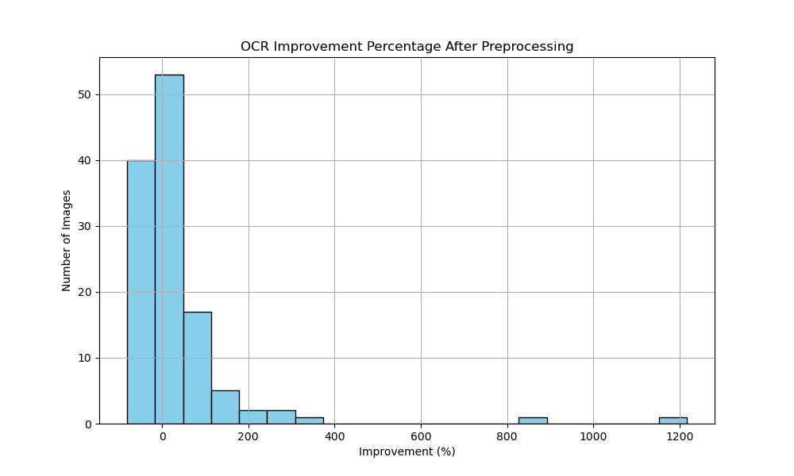

# Medical Prescription Extraction Pipeline

This repository was created with the help of ChatGPT.

## Preprocessing Improvement

In the preprocessing stage, several techniques were applied to improve the quality of the OCR (Optical Character Recognition) results. This involved:
1. **Denoising**: Reducing image noise that could interfere with text recognition.
2. **Contrast Enhancement**: Improving image contrast to make text stand out more clearly.
3. **Sharpening**: Sharpening the image to further improve text clarity.
4. **Resizing**: Resizing the images to ensure they are of optimal dimensions for text extraction.

The improvements were validated through a histogram of OCR improvement percentages, showing a significant increase in detected text compared to the original images.

## Running Google Gemini on Preprocessed Data

After preprocessing the images, we used the Google Gemini 1.5 Pro model to extract structured information from the images. The extracted data includes:
- **Patient Name**
- **Doctor Name**
- **Date**
- **Medications (Name, Dosage, Frequency, Duration)**
- **Special Instructions**

The data was saved in a structured JSON format, which can be further analyzed and used for the final evaluation.

## Initial Limited Manual Evaluation

Before moving on to a more extensive evaluation with multiple models, we conducted a limited manual cross-check of the data extracted by Google Gemini from the preprocessed images. The initial results show that the model is reasonably able to extract meaningful information, with almost correct patient and doctor names as well as drug prescriptions. This manual check was performed to assess the model's current capabilities in extracting structured information.

### Key Findings:
- **Patient and Doctor Names**: The model successfully extracts correct or near-correct names in most cases.
- **Drug Prescriptions**: The model accurately identifies medication names and their associated details, such as dosage and frequency, in most instances.

## Future Evaluation Strategy

In the future, we plan to expand the evaluation to compare the performance of three state-of-the-art models:
1. **Google Gemini 1.5 Pro**
2. **OpenAI GPT-4 Vision**
3. **Anthropic Claude 3 Opus**

We will evaluate the outputs of these models using the following metrics:
- **Field-level Agreement**: Comparing the extracted fields (e.g., Patient Name, Doctor Name, Medications) between the models.
- **Prescription-level Agreement**: Assessing how consistent the models are at a higher level of abstraction.
- **Fuzzy Matching**: Using similarity metrics such as Levenshtein distance to measure agreement between models in the extracted text.
